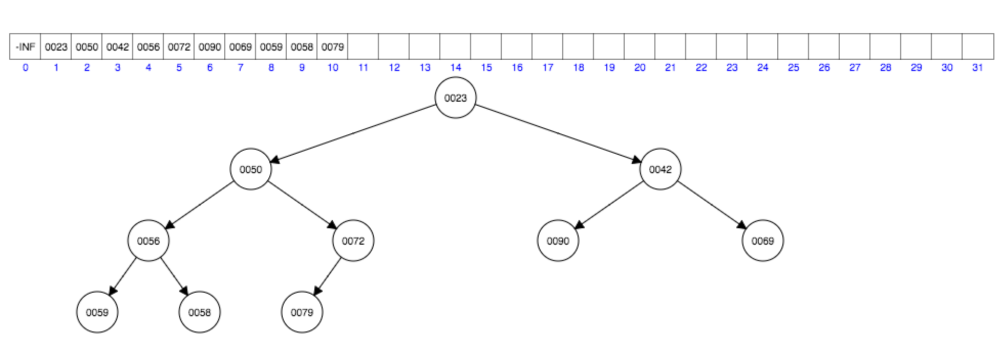
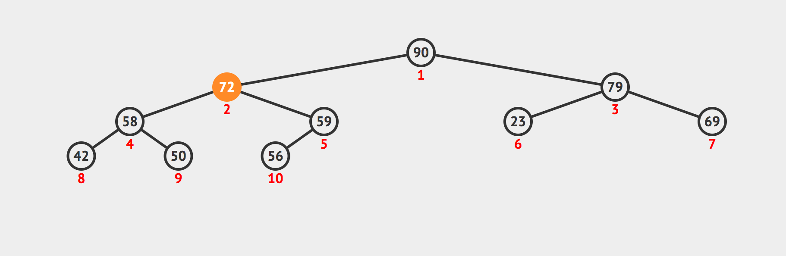

Binary Heap
===========

Implementation of a Binary Heap.

Operations:
 - `insert`
 - `remove`
 - `peek`

The `search` operation has been implemented to allow easy comparison between the operations of a Binary Heap and those of a Binary Search Tree.
Please, notice that `search` has a **O(n)** time complexity and could be omitted from a standard Binary Heap implementation.

_Min Binary Heap Example_  

_Max Binary Heap Example_  

